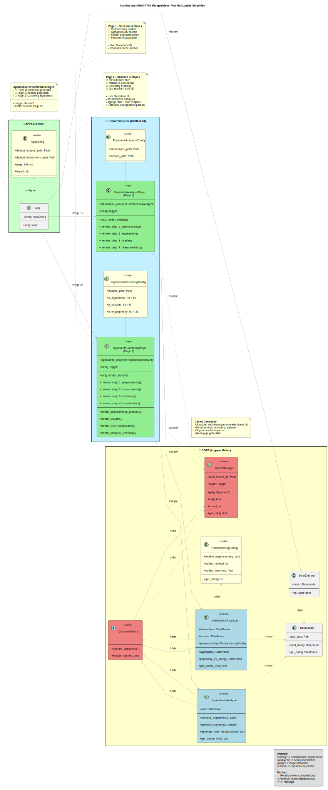

# IADATA700_mangetamain


Dans le cadre d'un enseignement à Telecom Paris, ce projet consiste en une application web interactive d'analyse de données pour une entreprise fictive : **Mangetamain** ; leader dans la recommandation B2C de recettes de cuisine à l'ancienne bio.

## ⚡ Démarrage rapide

```bash
# 1. Installation
uv sync

# 2. Prétraitement (PREMIÈRE FOIS UNIQUEMENT)
uv run python -m utils.preprocess_ingredients_matrix

# 3. Lancement de l'application
uv run python run_app.py
```

> 📥 **Auto-download intelligent** : Le script vérifie et télécharge automatiquement les données manquantes depuis S3.
> 
> ⚡ **Matrice précalculée** : Le preprocessing génère une matrice de co-occurrence 300x300 pour accélérer l'analyse de clustering (~5-10 min, 1 seule fois).

### 🎛️ Contrôle de l'application

**Démarrage** :
```bash
python run_app.py          # Lancement avec téléchargement auto des données
```

**Arrêt** :
- `Ctrl+C` dans le terminal de lancement
- Ou utiliser le script d'arrêt : `python stop_app.py`

**Alternative directe** (si les données sont déjà présentes) :
```bash
uv run streamlit run src/app.py
```

## 📚 Documentation

- 📖 **[Documentation complète (Sphinx)](docs/build/html/index.html)** - API reference, architecture, guides
- 🏗️ **[Diagramme de classes](docs/class-diagram.svg)** - Vue d'ensemble de l'architecture

## 🚀 Application Streamlit

### 📋 Pages disponibles
1. **🏠 Home** - Exploration générale des données (recettes ou interactions)
2. **🍳 Analyse de clustering des ingrédients** - Clustering basé sur la co-occurrence
3. **🔥 Analyse popularité des recettes** - Popularité (nombre d'interactions) vs note moyenne & caractéristiques (minutes, n_steps, n_ingredients)

### 🛠️ Lancement
```bash
uv sync
uv run streamlit run src/app.py
```

### 📂 Structure du projet
```
src/
├── app.py                          # Application principale Streamlit
├── core/                          # Modules de base
│   ├── data_loader.py            # Chargement des données
│   ├── data_explorer.py          # Exploration de base (accès aux données)
│   ├── interactions_analyzer.py  # Agrégations popularité / notes / features
│   └── ingredients_analyzer.py   # Analyse des ingrédients
├── components/                   # Composants de l'application
│   ├── ingredients_clustering_page.py     # Page clustering des ingrédients
│   └── popularity_analysis_page.py         # Page analyse popularité
└── utils/                        # Utilitaires (vide actuellement)
```

### 📊 Données requises
Chemins par défaut :
- **Recettes** : `data/RAW_recipes.csv`
- **Interactions** : `data/RAW_interactions.csv`

> 💡 **Prérequis** : Le fichier de données doit être présent localement dans le dossier `data/` à la racine du projet. Les données peuvent être télécharger avec le fichier download_data.py.

### ✨ Fonctionnalités
- **Page Home** : Exploration générale des données + métriques
- **Clustering Ingrédients** :
  - Sélection du nombre d'ingrédients à analyser
  - Regroupement normalisé + co-occurrences
  - Clustering K-means + t-SNE
  - Analyse de groupes & debug mappings
- **Popularité Recettes** :
  - Agrégat par recette : interaction_count, avg_rating, minutes, n_steps, n_ingredients
  - Scatter Note moyenne vs Popularité
  - Scatter Caractéristiques vs Popularité (taille = note)
  - Aperçu DataFrame fusionné (diagnostic)
  - Filtre sur interactions minimales
  - Prétraitement IQR configurable (exclut les notes pour préserver la distribution réelle)
  - Segmentation par percentiles (Low ≤ P25, Medium ≤ P75, High ≤ P95, Viral > P95)

## 📐 Architecture UML

### 🖼️ Visualisation directe



<details>
<summary><b>Aperçu (image PNG)</b></summary>


> ⚠️ **Si l'image ne s'affiche pas** : Générez-la avec `plantuml docs/class-diagram.puml`

</details>

**Générer le diagramme :**
```bash
# Installation PlantUML (macOS)
brew install plantuml

# Génération PNG haute résolution (200 DPI)
plantuml docs/class-diagram.puml

# Ou SVG pour zoom sans perte
plantuml -tsvg docs/class-diagram.puml
```


## 🔄 Preprocessing des données

### Matrice de co-occurrence des ingrédients

Le projet utilise un preprocessing offline pour optimiser les performances de la page de clustering des ingrédients.

**📍 Localisation** : `utils/preprocess_ingredients_matrix.py`

**🎯 Objectif** :
Générer une matrice de co-occurrence 300×300 pré-calculée analysant ~230 000 recettes pour identifier les associations fréquentes d'ingrédients.

**⚙️ Processus** :
1. **Normalisation NLP** : Nettoyage des ingrédients (lowercase, 50 stop words, regex)
2. **Sélection** : Top 300 ingrédients par fréquence d'apparition
3. **Construction** : Matrice de co-occurrence symétrique
4. **Export** : Fichiers CSV dans `data/`

**🚀 Exécution** :
```bash
# Première installation - génération requise (5-10 minutes)
uv run python -m utils.preprocess_ingredients_matrix
```

**📊 Fichiers générés** :
- `data/ingredients_cooccurrence_matrix.csv` (~15-20 MB) : Matrice 300×300
- `data/ingredients_list.csv` (~10 KB) : Liste des 300 ingrédients avec fréquences

## 🧪 Tests & Qualité

### Exécuter les tests
```bash
# Tous les tests
uv run pytest

# Tests avec couverture
uv run pytest --cov=src --cov-report=html

# Tests spécifiques
uv run pytest tests/test_ingredients_clustering_page.py
uv run pytest tests/test_preprocess_ingredients_matrix.py

# Mode verbose
uv run pytest -v
```

### Logger
Le projet utilise un système de logging structuré dans `debug/` :
- **`debug/debug.log`** : Logs INFO/DEBUG détaillés
- **`debug/errors.log`** : Erreurs uniquement


